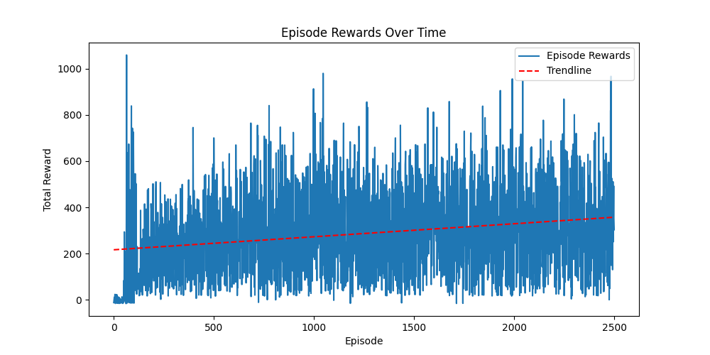
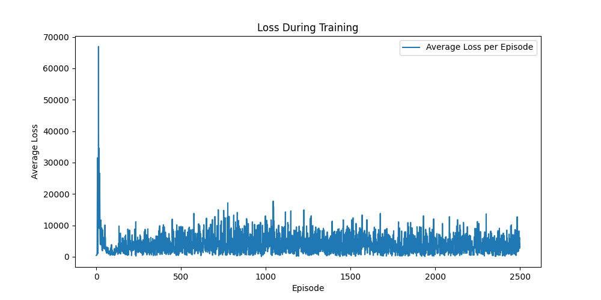

# BeatSnake
A project dedicated to implementing reinforcement learning to teach an AI agent to play the game of snake with the goal of beating it. The chosen RL technique is Q-Learning, implemented in agent.py

### Instructions:
1) Install the required Python Packages by running

```bash
pip install -r requirements.txt
```
2) ***Optional***: The model in the repo is already trained (weights located in 'q_network.pth'), to re-train the model, delete existing weights and run
```bash
python3 train.py
```
3) To run the AI Agent playing the game, run
```bash
python3 play.py
```

## Results:




